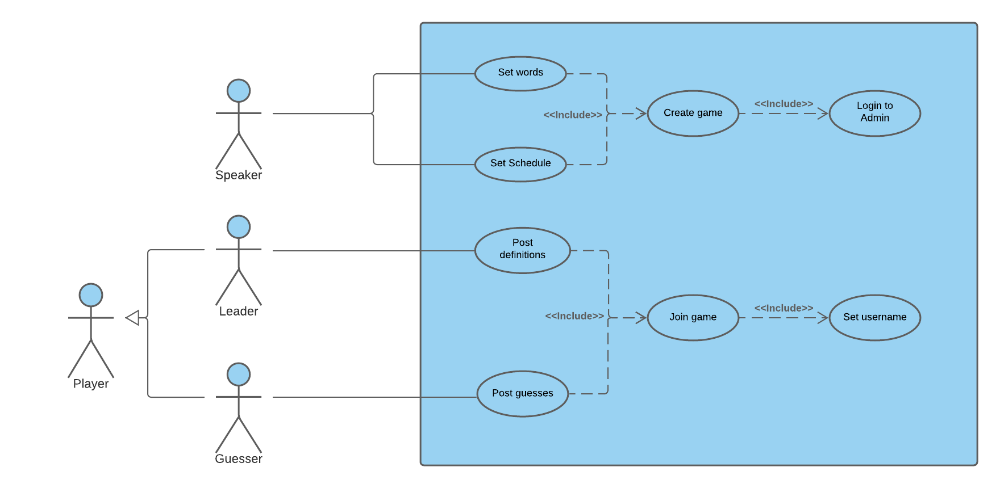
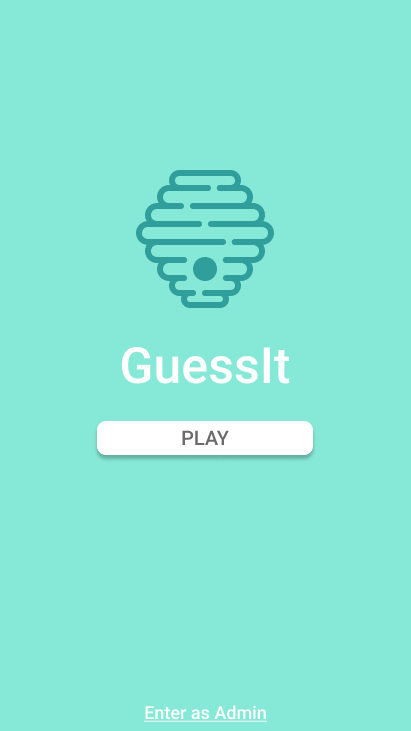
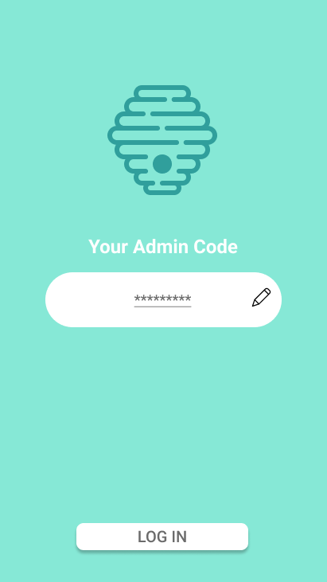
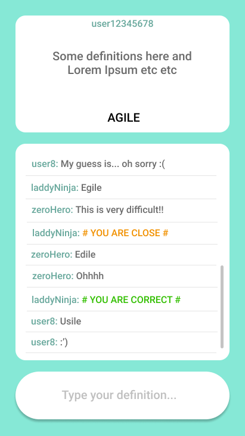
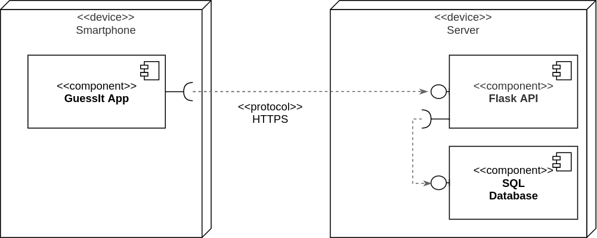
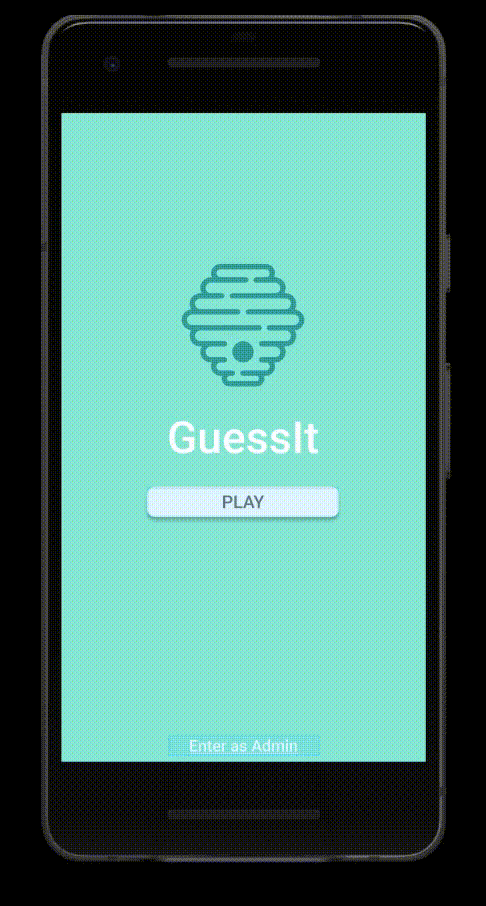

# openCX-esofagos Development Report

Welcome to the documentation pages of the GuessIt of **openCX**!

You can find here detailed about the (sub)product, hereby mentioned as module, from a high-level vision to low-level implementation decisions, a kind of Software Development Report (see [template](https://github.com/softeng-feup/open-cx/blob/master/docs/templates/Development-Report.md)), organized by discipline (as of RUP): 

* Business modeling 
  * [Product Vision](#Product-Vision)
  * [Elevator Pitch](#Elevator-Pitch)
* Requirements
  * [Use Case Diagram](#Use-case-diagram)
  * [User stories](#User-stories)
  * [Domain model](#Domain-model)
* Architecture and Design
  * [Logical architecture](#Logical-architecture)
  * [Physical architecture](#Physical-architecture)
  * [Prototype](#Prototype)
* [Implementation](#Implementation)
* [Test](#Test)
* [Configuration and change management](#Configuration-and-change-management)
* [Project management](#Project-management)

So far, contributions are exclusively made by the initial team, but we hope to open them to the community, in all areas and topics: requirements, technologies, development, experimentation, testing, etc.

Please contact us! 

Thank you!

* [Eduardo Brito](https://github.com/edurbrito)

* [Paulo Ribeiro](https://github.com/PJscp16)
  
* [Pedro Ferreira](https://github.com/pdff2000)

* [Pedro Ponte](https://github.com/pedrovponte)

---

## Product Vision

The game we created aims to entertain the sessions, empowering conferences with interactive learning. That way, people at a given session can play with each other, have fun and put their knowledge about the subjects to the test.

---
## Elevator Pitch

**GuessIt** is a brand new game designed for the audience of a given conference. It allows the speaker to test the public knowledge about the learned concepts, challenging everybody in the room.
In this interactive game, there are two types of players:

* **The “Leaders”**, who have to describe the concept they were given the best they know, within the given time, by giving definitions of what they were assigned to explain.
* **The “Guessers”**, who have to guess the right word within the given time, and try to be the fastest ones. They write their guesses to a live chat, where they can see others’ failed answers.
Therefore, the participants get to play and learn with each other, while having a lot of fun!

---
## Requirements

### Use cases diagram

#### **Create game:**
* **Actor:**
Conference Speaker
* **Description:**
This use case exists so that the speaker can define the game schedule (duration and starting time) and the list of words related to the session to be used in it.
* **Preconditions and Postconditions:** 
In order to set the game definitions, the conference speaker must first login into the application. After this use case, a game session will be created, and any conference participant may join.
* **Normal Flow:**
1. The conference speaker presses the Login button, to get admin access to the application.
2. The conference speaker inserts the admin code.
3. If the code is accepted, admin access to the application is granted to the speaker.
4. After this, the speaker chooses the starting time and duration of the game, as well as the list of words.
 
* **Alternative Flows and Exceptions:**
1. The conference speaker presses the Login button, to get admin access to the application.
2. The conference speaker inserts the admin code.
3. If the code is rejected, admin access to the application is denied to the speaker.
4. The speaker can then retype the code, and proceed as normal.
 
 
#### **Post definitions:**
* **Actor:**
Leader (extends Player)
* **Description:**
This use case exists so that the current game leader can write its definitions of the current word and show them to the guessers.
* **Preconditions and Postconditions:**
In order to post a definition, the player must first join the game session. In the end, the player’s definitions will be shown to all the other players in the live chat.
* **Normal Flow:**
1. While playing, the player may get the Leader role - he must then write some definitions and send them to the chat.
2. If the definition is allowed and checked by the system, it will be shown to all the guessers.
* **Alternative Flows and Exceptions:**
1. While playing, the player may get the Leader role - he must then write some definitions and send them to the chat.
2. If the definition is not allowed by the system, it will be hidden and the leader gets a warning.
3. The leader can then retype his sentence, and proceed as normal.

#### **Post guesses:**
* **Actor:** 
Guesser (extends Player)
* **Description:**
This use case exists so that a Guesser can write its guesses of the right word and send them to the live chat.
* **Preconditions and Postconditions:**
In order to write its guesses, the player must first join the game session. In the end, the player’s guesses will be shown to all the other players in the live chat, unless its guess is right or close to the right answer.
* **Normal Flow:**
1. The Guesser writes its guess.
2. If the guess is right, it isn’t shown in the chat, and a message is displayed telling the Guesser that it was correct.
* **Alternative Flows and Exceptions:**
1. The Guesser writes its guess.
2. If the guess is close to the right answer, it isn’t shown in the chat, and a warning is displayed telling the Guesser that it’s not far from being correct.

* **Or:**
1. The Guesser writes its guess.
2. If the guess is wrong, it will be shown to all the guessers.

### User stories

> Actors: Guesser or Leader; Speaker

* **User Story 1:**
As the conference speaker, I would like to have an admin panel in order to create the next game session.

|  |  |  |
| --- | --- | --- |

**Value:** Must have
**Effort:** L

-----

* **User Story 2:**
As the conference speaker, I would like to define the starting time and the duration of the game, so that I don’t have to worry about unforeseen delays.

**Value:** Must Have
**Effort:** M

-----

* **User Story 3:**
As the conference speaker, I would like to suggest a list of concepts related to my session, so that it can be used by the app to include them in the game.

**Value:** Must Have
**Effort:** M

-----

* **User Story 4:**
As a player, I would like to participate in the game anonymously, so I can feel more at ease and freely write my guesses without the fear of failing.

**Value:** Must Have
**Effort:** S

-----

* **User Story 5:**
As a player, I would like to see all the other players’ missed answers in a live chat, so that I can get some insights about my potential guesses.

**Value:** Must Have
**Effort:** XL

-----

* **User Story 6:**
As a guesser, I would like to know if I'm close to the answer, by miswriting it or swapping some letters.

**Value:** Could Have
**Effort:** M

-----

* **User Story 7:**
As a leader, I would like the game to give some clues about the word if the players are taking too long to guess it, like writing my definitions of it or saying how many letters it has, for example.

**Value:** Must Have
**Effort:** M

-----

* **User Story 8:**
As a player, I would like to see a ranking of all the players, based on the points they made.

**Value:** Could Have
**Effort:** M

-----

* **User Story 9:**
As the conference speaker, I would like to see the statistics of the game, so I can know which words were the most difficult to guess, in order to better explain those topics to the audience.

**Value:** Could Have
**Effort:** M

-----

* **User Story 10:**
As the conference speaker, I would like to generate a final report with the word definitions given by the players, so that I can discuss them with the audience.

**Value:** Could Have
**Effort:** M

-----

### Domain model

---

## Architecture and Design

The architecture of a software system encompasses the set of key decisions about its overall organization.

### Logical architecture

Our high-level structure will follow the MVC Architectural Pattern, as it is a good standard for this type of project.

Firstly comes the Model, that contains all the application data, including the game session settings, the players' info, and all the chat related data. 

Next, it's the View, representing the concrete display of the app state and data for its users. 

Finally, the Controller, the one connecting the other parts, which consists of interfaces that aggregate all the work and, through the users' course of actions, generate or trigger the corresponding functionalities.

### Physical architecture

The physical architecture of our project relies on two distinct blocks. 

* The Client Side that represents the GuessIt Flutter App, installed on the user's smartphone. 
  
* The Server Side, where the controller will live, containing a Flask API, as a SocketIO implementation, and a connected SQL database to store and persist the needed data. 

Both sides communicate over HTTPS with some required and provided interfaces to simplify all the process. As mentioned, the technologies considered were Flutter, for the mobile UI, as it was globally accepted by all the class, and Flask + SQL, for the server, as a very lightweight and simple combination, that suits perfectly our project needs.

### Prototype

For the application prototype, we aggregated the most relevant User Stories and created a vertical visual prototype. Clicking the buttons triggers the expected flow that the future app will have, navigating through the different screens and states of the application.

The general user interface structure is set and the work on the backend service provider has also begun. The app, as testified, will have a first screen with two possible ways of entering: 
* The *Play* button for Players to choose the nickname and join the game;
* The *Enter As Admin* button that leads the user to the admin panel, if he knows the admin code.

The Admin creates the game, filling the forms and setting the options, and the Players then join it, within a screen that contains a live chat and the other necessary components.

[Our Vertical Prototype with Figma](https://www.figma.com/proto/WvP0fsV2j0afVBldhMCfyF/Story-1?node-id=1%3A3&scaling=scale-down)

---

## Implementation
Regular product increments are a good practice of product management. 

While not necessary, sometimes it might be useful to explain a few aspects of the code that have the greatest potential to confuse software engineers about how it works. Since the code should speak by itself, try to keep this section as short and simple as possible.

Use cross-links to the code repository and only embed real fragments of code when strictly needed, since they tend to become outdated very soon.

---
## Test

There are several ways of documenting testing activities, and quality assurance in general, being the most common: a strategy, a plan, test case specifications, and test checklists.

In this section it is only expected to include the following:
* test plan describing the list of features to be tested and the testing methods and tools;
* test case specifications to verify the functionalities, using unit tests and acceptance tests.
 
A good practice is to simplify this, avoiding repetitions, and automating the testing actions as much as possible.

---
## Configuration and change management

Configuration and change management are key activities to control change to, and maintain the integrity of, a project’s artifacts (code, models, documents).

For the purpose of ESOF, we will use a very simple approach, just to manage feature requests, bug fixes, and improvements, using GitHub issues and following the [GitHub flow](https://guides.github.com/introduction/flow/).

---

## Project management

Software project management is an art and science of planning and leading software projects, in which software projects are planned, implemented, monitored and controlled.

In the context of ESOF, we expect that each team adopts a project management tool capable of registering tasks, assign tasks to people, add estimations to tasks, monitor tasks progress, and therefore being able to track their projects.

Example of tools to do this are:
  * [Trello.com](https://trello.com)
  * [Github Projects](https://github.com/features/project-management/com)
  * [Pivotal Tracker](https://www.pivotaltracker.com)
  * [Jira](https://www.atlassian.com/software/jira)

We recommend to use the simplest tool that can possibly work for the team.
